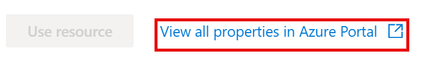
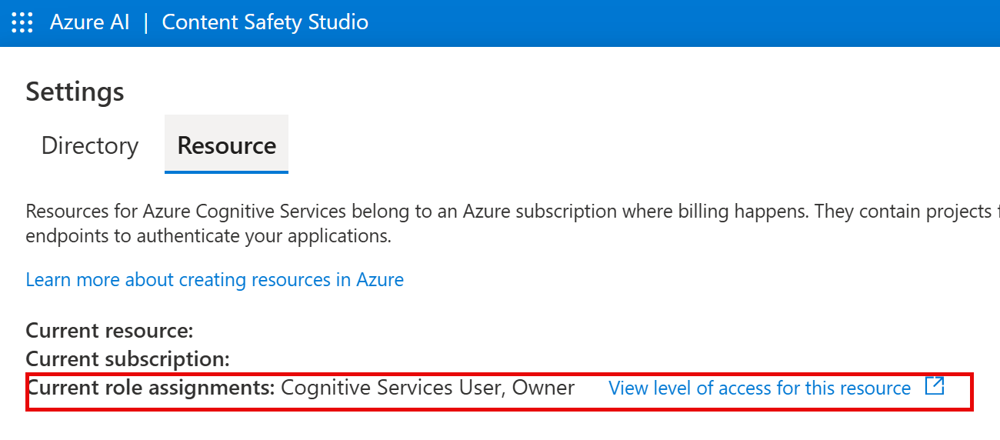

---
lab:
  title: "Erkunden von Azure\_KI Services"
---

# Erkunden von Azure KI Services

Mit Azure KI Services können Benutzer*innen KI-Anwendungen mit sofort einsatzbereiten, vorgefertigten und anpassbaren APIs und Modellen erstellen. In dieser Übung werfen Sie einen Blick auf einen der Dienste, Azure KI Inhaltssicherheit, in Content Safety Studio.

Mit Content Safety Studio können Sie untersuchen, wie Text- und Bildinhalte moderiert werden können. Sie können Tests für Beispieltext oder -bilder ausführen und für jede Kategorie einen Schweregrad von sicher bis hoch erhalten. In dieser Lab-Übung werden Sie eine Single-Service-Ressource in Content Safety Studio erstellen und ihre Funktionalitäten testen. 

> **Hinweis**: Das Ziel dieser Übung besteht darin, ein allgemeines Verständnis dafür zu gewinnen, wie Azure KI Services bereitgestellt und verwendet werden. Content Safety wird als Beispiel verwendet, aber es wird nicht erwartet, dass Sie in dieser Übung ein umfassendes Wissen über Content Safety erwerben!

## Navigation in Content Safety Studio 

1. Öffnen Sie [Content Safety Studio](https://contentsafety.cognitive.azure.com?azure-portal=true). Wenn Sie nicht eingeloggt sind, müssen Sie sich anmelden. Wählen Sie oben rechts auf dem Bildschirm **Anmelden** aus. Verwenden Sie die E-Mail-Adresse und das Kennwort, die Ihrem Azure-Abonnement zugeordnet sind, um sich anzumelden. 

1. Content Safety Studio ist wie viele andere Studios für Azure KI Services eingerichtet. Klicken Sie im Menü oben auf dem Bildschirm auf das Symbol links neben *Azure KI*. Sie sehen eine Dropdownliste mit anderen Studios, die für die Entwicklung mit Azure KI Services entworfen wurden. Wenn Sie erneut auf das Symbol klicken, wird die Liste ausgeblendet.

  

## Dem Studio eine Ressource zuordnen 

Bevor Sie das Studio verwenden, müssen Sie dem Studio eine Azure KI Services-Ressource zuordnen. Je nach Studio benötigen Sie vielleicht eine spezielle Single-Service-Ressource oder können eine allgemeine Multi-Service-Ressource verwenden. Im Falle von Content Safety Studio können Sie den Dienst nutzen, indem Sie eine Single-Service *Content Safety*-Ressource oder eine allgemeine Multi-Service Ressource für *Azure KI Services* erstellen. In den folgenden Schritten erstellen wir eine Single-Service Content Safety-Ressource. 

1. Klicken Sie oben rechts auf dem Bildschirm auf das Symbol **Einstellungen**. 

2. Auf der Seite **Einstellungen** werden die Registerkarten *Verzeichnis* und *Ressource* angezeigt. Wählen Sie auf der Registerkarte *Ressource* die Option **Neue Ressource erstellen** aus. Dadurch gelangen Sie zur Seite, um eine Ressource im Azure-Portal zu erstellen.

> **Hinweis**: Auf der Registerkarte *Verzeichnis* können Benutzer verschiedene Verzeichnisse auswählen, aus denen Ressourcen erstellt werden sollen. Sie müssen die Einstellungen nicht ändern, es sei denn, Sie möchten ein anderes Verzeichnis verwenden. 

3. Auf der Seite *Content Safety erstellen* im [Azure-Portal](https://portal.azure.com?azure-portal=true) müssen Sie mehrere Details konfigurieren, um Ihre Ressource zu erstellen. Konfigurieren Sie sie mit den folgenden Einstellungen:
    - **Abonnement**: *Ihr Azure-Abonnement*.
    - **Ressourcengruppe**: *Wählen Sie eine Ressourcengruppe aus, oder erstellen Sie eine Ressourcengruppe mit einem eindeutigen Namen*.
    - **Region:** *Wählen Sie eine verfügbare Region aus. Wenn Sie sich im Osten der USA befinden, verwenden Sie „USA, Osten 2“.*
    - **Name**: *Geben Sie einen eindeutigen Namen ein*.
    - **Tarif**: Free F0

4. Wählen Sie **Überprüfen + Erstellen** aus und überprüfen Sie die Konfiguration. Wählen Sie dann **Erstellen** aus. Auf dem Bildschirm wird angezeigt, wann die Bereitstellung abgeschlossen ist. 

*Glückwunsch! Sie haben gerade eine Azure KI Services-Ressource erstellt oder bereitgestellt. Die von Ihnen bereitgestellte Ressource ist eine Single-Service Content Safety Service-Ressource.*

5. Öffnen Sie nach Abschluss der Bereitstellung eine neue Registerkarte und kehren Sie zu [Content Safety Studio](https://contentsafety.cognitive.azure.com?azure-portal=true) zurück. 

6. Wählen Sie erneut das Symbol **Einstellungen** in der rechten oberen Ecke des Bildschirms aus. Dieses Mal sollten Sie sehen, dass Ihre neu erstellte Ressource der Liste hinzugefügt wurde.  

>**Hinweis:** Wenn Sie ein Cloud Slice-Abonnement verwenden, können Sie die Schritte 7 bis 12 überspringen und den Prozess ab Schritt 13 fortsetzen. Fahren Sie andernfalls mit Schritt 7 fort.

7. Wählen Sie unten auf dem Bildschirm *Einstellungen* **Alle Eigenschaften im Azure-Portal anzeigen** aus. 

8. Wählen Sie im Azure-Portal die *Inhaltssicherheit*-Ressource aus, die Sie soeben erstellt haben. Wählen Sie dann im linken Bereich **Access Control (IAM)** aus. Wählen Sie dann im geöffneten Bereich neben dem Pluszeichen **Hinzufügen** und anschließend **Rollenzuweisung hinzufügen** aus. 

9. Suchen Sie in der Liste der Rollen nach **Cognitive Services-Benutzer**, und wählen Sie die Rolle aus. Wählen Sie **Weiter**aus. 

10. Verwenden Sie die folgenden Einstellungen, um sich die Rolle zuzuweisen: 
    - **Zugriff zuweisen auf**: Wählen Sie *Benutzer, Gruppe oder Dienstprinzipal* aus.
    - **Mitglieder**: Klicken Sie auf *Mitglieder auswählen*.
        - Suchen Sie im geöffneten Bereich *Mitglieder auswählen* nach Ihrem Namen. Klicken Sie neben Ihrem Namen auf das Pluszeichen. Klicken Sie dann auf **Auswählen**.
    - **Beschreibung**: *Lassen Sie dieses Feld frei.*

11. Wählen Sie **Überprüfen und Zuweisen** und dann erneut **Überprüfen und Zuweisen** aus, um die Rollenzuweisung hinzuzufügen.    

12. Kehren Sie unter [https://contentsafety.cognitive.azure.com](https://contentsafety.cognitive.azure.com) zu Content Safety Studio zurück. Wählen Sie dann das Symbol **Einstellungen** in der rechten oberen Ecke des Bildschirms aus. 

 
13. Wählen Sie die soeben erstellte Azure KI-Dienstressource aus. Vergewissern Sie sich, dass unter *Aktuelle Rollenzuweisungen* sowohl *Cognitive Services-Benutzer* als auch *Besitzer* angezeigt werden.

14. Klicken Sie unten auf dem Bildschirm auf **Ressource verwenden**. Sie werden zur Studio-Startseite zurückgeleitet. Jetzt können Sie mit der Verwendung von Studio mit Ihrer neu erstellten Ressource beginnen.

## Testen der Textmoderation im Content Safety Studio

1. Navigieren Sie auf der Startseite von Content Safety Studio unter *Moderationstests ausführen* zum Feld **Moderater Textinhalt** und klicken Sie auf **Ausprobieren**.
1. Klicken Sie unter Ausführen eines einfachen Tests auf **Sichere Inhalte**. Beachten Sie, dass im Feld darunter Text angezeigt wird. 
1. Klicken Sie auf **Run test**. Wenn Sie einen Test ausführen, wird das Deep Learning-Modell des Content Safety-Diensts aufgerufen. Das Deep Learning-Modell wurde bereits darauf trainiert, unsichere Inhalte zu erkennen.
1. Überprüfen Sie im Bereich *Ergebnisse* die Ergebnisse. Es gibt vier Schweregrade von sicher bis hoch und vier Arten von schädlichen Inhalten. Stuft der Content Safety KI-Dienst dieses Beispiel als akzeptabel ein oder nicht? Wichtig ist, dass die Ergebnisse innerhalb eines Konfidenzintervalls liegen. Ein gut trainiertes Modell, wie eines der vordefinierten Modelle von Azure KI, kann Ergebnisse zurückgeben, die mit hoher Wahrscheinlichkeit dem entsprechen, wie ein Mensch das Ergebnis bezeichnen würde. Jedes Mal, wenn Sie einen Test ausführen, rufen Sie das Modell erneut auf. 
1. Versuchen Sie es mit einem anderen Beispiel. Wählen Sie den Text unter Gewalttätiger Inhalt mit Schreibfehlern aus. Überprüfen Sie, ob der Inhalt im Feld darunter angezeigt wird.
1. Klicken Sie auf **Test ausführen** und überprüfen Sie die Ergebnisse im Ergebnisbereich erneut. 

Sie können Tests für alle bereitgestellten Beispiele ausführen und dann die Ergebnisse überprüfen.

## Überprüfen der Schlüssel und des Endpunkts

Diese von Ihnen getesteten Funktionen können in alle Arten von Anwendungen programmiert werden. Die Schlüssel und der Endpunkt, die für die Anwendungsentwicklung verwendet werden, finden Sie sowohl in Content Safety Studio als auch im Azure-Portal. 

1. Navigieren Sie in Content Safety Studio zurück zur Seite **Einstellungen** und wählen Sie die Registerkarte *Ressourcen* aus. Suchen Sie nach der Ressource, die Sie verwendet haben. Scrollen Sie, um den Endpunkt und Schlüssel für Ihre Ressource anzuzeigen. 
1. Im Azure-Portal sehen Sie, dass es sich um *denselben* Endpunkt und *verschiedene* Schlüssel für Ihre Ressource handelt. Wechseln Sie zum [Azure-Portal](https://portal.azure.com?auzre-portal=true), um es auszuprobieren. Suchen Sie in der oberen Suchleiste nach *Content Safety*. Suchen Sie nach Ihrer Ressource und klicken Sie darauf. Suchen Sie im Menü auf der linken Seite unter *Ressourcenverwaltung* nach *Schlüssel und Endpunkte*. Wählen Sie **Schlüssel und Endpunkte** aus, um den Endpunkt und die Schlüssel für Ihre Ressource anzuzeigen. 

Wenn Sie fertig sind, können Sie die Content Safety-Ressource aus dem Azure-Portal löschen. Das Löschen der Ressource ist eine Möglichkeit, die Kosten zu senken, die anfallen, wenn die Ressource im Abonnement vorhanden ist. Navigieren Sie hierzu in Ihrer Content Safety-Ressource zur Seite **Übersicht**. Wählen Sie oben auf dem Bildschirm **Löschen** aus.

