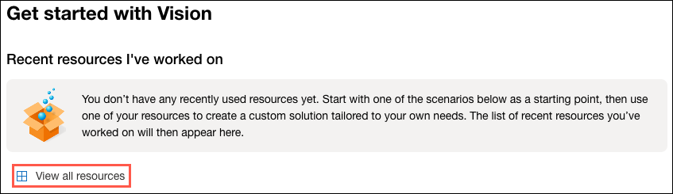

---
lab:
  title: Erkennen von Gesichtern in Vision Studio
---

# Erkennen von Gesichtern in Vision Studio

Bei Vision-Lösungen ist häufig KI erforderlich, um menschliche Gesichter erkennen zu können. Angenommen, das fiktive Einzelhandelsunternehmen Northwind Traders möchte herausfinden, wo sich die Kunden in einem Geschäft befinden, um sie bestmöglich zu bedienen. Eine Möglichkeit, dies zu erreichen, besteht darin, festzustellen, ob die Bilder Gesichter gehalten. Wenn dies der Fall ist, werden die Koordinaten des Begrenzungsrahmens ermittelt, der ihre Position angibt.

Um die Gesichtserkennungsfunktionen des Azure KI Gesichtserkennungsdiensts zu testen, verwenden Sie [Azure Vision Studio](https://portal.vision.cognitive.azure.com/). Dabei handelt es sich um eine UI-basierte Plattform, mit der Sie die Funktionen von Azure KI Vision erkunden können, ohne selbst Code schreiben zu müssen.

## Erstellen einer *Azure KI Services*-Ressource

Sie können den Azure KI Gesichtserkennungsdienst mit einer **Azure KI Services**-Ressource für mehrere Dienste verwenden. Wenn dies noch nicht erfolgt ist, erstellen Sie eine **Azure KI Services**-Ressource in Ihrem Azure-Abonnement.

1. Öffnen Sie auf einer anderen Browserregisterkarte das Azure-Portal unter [https://portal.azure.com](https://portal.azure.com?azure-portal=true), und melden Sie sich mit dem Microsoft-Konto an, das Ihrem Azure-Abonnement zugeordnet ist.

1. Klicken Sie auf die Schaltfläche **＋Ressource erstellen** und suchen Sie nach *Azure KI Services*. Wählen Sie **Erstellen** eines **Azure KI Services**-Plans aus. Sie werden zu einer Seite weitergeleitet, um eine Azure KI Services-Ressource zu erstellen. Konfigurieren Sie sie mit den folgenden Einstellungen:
    - **Abonnement**: *Ihr Azure-Abonnement*.
    - **Ressourcengruppe**: *Wählen Sie eine Ressourcengruppe aus, oder erstellen Sie eine Ressourcengruppe mit einem eindeutigen Namen*.
    - **Region:** USA, Osten.
    - **Name**: *Geben Sie einen eindeutigen Namen ein*.
    - **Tarif**: *Standard S0.*
    - **Durch Aktivieren dieses Kontrollkästchens bestätige ich, dass ich die folgenden Bedingungen gelesen und verstanden habe**: *Ausgewählt*.

1. Wählen Sie die Option **Überprüfen und erstellen** und dann **Erstellen** aus, und warten Sie, bis die Bereitstellung abgeschlossen ist.

## Verbinden Ihrer Azure KI Services-Ressource mit Vision Studio

Verbinden Sie als Nächstes die oben bereitgestellte Azure KI Services-Ressource mit Vision Studio.

1. Navigieren Sie auf einer anderen Browserregisterkarte zu **Vision Studio** unter [https://portal.vision.cognitive.azure.com](https://portal.vision.cognitive.azure.com?azure-portal=true).

1. Melden Sie sich mit Ihrem Konto an, und stellen Sie sicher, dass Sie dasselbe Verzeichnis wie das Verzeichnis verwenden, in dem Sie Ihre Azure KI Services-Ressource erstellt haben.

1. Wählen Sie auf der Startseite von Vision Studio **Alle Ressourcen anzeigen** unter der Überschrift **Erste Schritte mit Vision** aus.

    

1. Zeigen Sie auf der Seite **Wählen Sie eine Ressource aus, mit der Sie arbeiten möchten** mit dem Mauszeiger in der Liste auf die Ressource, die Sie oben erstellt haben, aktivieren Sie dann das Kontrollkästchen links neben dem Ressourcennamen, und wählen Sie dann **Als Standardressource auswählen** aus.

    > **Hinweis**: Wenn Ihre Ressource nicht aufgeführt wird, müssen Sie die Seite unter Umständen **aktualisieren**.

    

1. Schließen Sie die Einstellungsseite, indem Sie in der oberen rechten Bildschirmecke „x“ auswählen.

## Erkennen von Gesichtern in Vision Studio 

1. Navigieren Sie in einem Webbrowser zu **Vision Studio** unter [https://portal.vision.cognitive.azure.com](https://portal.vision.cognitive.azure.com?azure-portal=true).

1. Wählen Sie auf der Landing Page **Getting started with Vision** die Registerkarte **Face** aus, und wählen Sie dann die Kachel **Detect Faces in an image** aus.

1. Bestätigen Sie unter der Unterüberschrift **Try It Out** die Ressourcennutzungsrichtlinie, indem Sie diese lesen und das Kontrollkästchen aktivieren.  

1. Wählen Sie die einzelnen Beispielbilder aus, und beobachten Sie die zurückgegebenen Gesichtserkennungsdaten.

1. Jetzt probieren wir die Funktion mit einigen unserer eigenen Bilder aus. Wählen Sie [**https://aka.ms/mslearn-detect-faces**](https://aka.ms/mslearn-detect-faces) aus, um **detect-faces.zip** herunterzuladen. Wählen Sie einen lokalen Ordner auf Ihrem Computer aus.

1. Suchen Sie die Datei namens **store-camera-1.jpg**, die das folgende Bild enthält:

    

1. Laden Sie **store-camera-1.jpg** hoch, und überprüfen Sie die zurückgegebenen Gesichtserkennungsdetails.

1. Suchen Sie die Datei namens **store-camera-2.jpg**, die das folgende Bild enthält:

    

1. Laden Sie **store-camera-2.jpg** hoch, und überprüfen Sie die zurückgegebenen Gesichtserkennungsdetails.

1. Suchen Sie die Datei namens **store-camera-3.jpg**, die das folgende Bild enthält:

    

1. Laden Sie **store-camera-3.jpg** hoch, und überprüfen Sie die zurückgegebenen Gesichtserkennungsdetails. Beachten Sie, dass die Gesichtserkennung von Azure KI das verdeckte Gesicht nicht erkannt hat.

In dieser Übung haben Sie untersucht, wie Azure KI Services Gesichter in Bildern erkennen kann. Wenn Sie Zeit haben, können Sie die Beispielbilder oder einige Ihrer eigenen Bilder ausprobieren.

## Bereinigung

Wenn Sie nicht vorhaben, weitere Übungen zu machen, löschen Sie alle Ressourcen, die Sie nicht mehr benötigen. Dadurch werden unnötige Kosten vermieden.

1. Öffnen Sie das **Azure-Portal** auf [https://portal.azure.com](https://portal.azure.com?azure-portal=true), und wählen Sie die Ressourcengruppe aus, die die von Ihnen erstellte Ressource enthält.
1. Wählen Sie die Ressource, dann **Löschen** und anschließend **Ja** aus, um den Löschvorgang zu bestätigen. Die Ressource wird dann gelöscht.

## Weitere Informationen

Weitere Informationen über die Möglichkeiten dieses Diensts erfahren Sie auf der Seite [Azure KI Gesichtserkennung](https://learn.microsoft.com/azure/ai-services/computer-vision/overview-identity).
