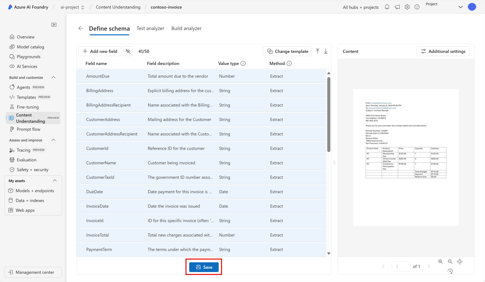

---
lab:
  title: "Extrahieren von Daten mit „Inhaltsverständnis“ im Azure\_AI Foundry-Portal"
---

# Extrahieren von Daten mit „Inhaltsverständnis“ im Azure AI Foundry-Portal

**Verständnis von Azure AI-Inhalten (Vorschau)** nutzt generative KI, um Inhalte verschiedenster Art (Dokumente, Bilder, Videos und Audio) in einem benutzerdefinierten Ausgabeformat zu verarbeiten.

In dieser Übung verwenden Sie „Verständnis von Azure AI-Inhalten“ im Azure AI Foundry-Portal, der Microsoft-Plattform zum Erstellen intelligenter Anwendungen, um Daten aus Rechnungen zu erkennen. 

Diese Übung dauert ca. **25** Minuten.

## Erstellen eines Azure KI Foundry-Projekts

Beginnen wir mit dem Erstellen eines Azure AI Foundry-Projekts.

1. Öffnen Sie in einem Webbrowser unter `https://ai.azure.com` das [Azure KI Foundry-Portal](https://ai.azure.com) und melden Sie sich mit Ihren Azure-Anmeldeinformationen an. Schließen Sie alle Tipps oder Schnellstartfenster, die bei der ersten Anmeldung geöffnet werden, und verwenden Sie gegebenenfalls das Logo **Azure AI Foundry** oben links, um zur Startseite zu navigieren, die ähnlich wie die folgende Abbildung aussieht (schließen Sie das **Hilfe**-Fenster, falls es geöffnet ist):

    

1. Wählen Sie auf der Startseite **+ Projekt erstellen**.

1. Geben Sie im Assistenten **Projekt erstellen** einen gültigen Namen für Ihr Projekt ein und wählen Sie, falls ein vorhandener Hub vorgeschlagen wird, die Option, einen neuen zu erstellen. Überprüfen Sie dann die Azure-Ressourcen, die automatisch erstellt werden, um Ihren Hub und Ihr Projekt zu unterstützen.

1. Wählen Sie **Anpassen** aus und legen Sie die folgenden Einstellungen für Ihren Hub fest:
    - **Hubname**: *Geben Sie einen gültigen Namen für Ihren Hub an*
    - **Abonnement:** *Geben Sie Ihr Azure-Abonnement an.*
    - **Ressourcengruppe**: *Erstellen Sie eine Ressourcengruppe, oder wählen Sie eine Ressourcengruppe aus*.
    - **Standort**: USA (Westen) 
    - A**zure KI Services oder Azure OpenAI verbinden**: *Wählen Sie Neuen KI-Dienst erstellen aus*
    - **Azure KI-Suche verbinden**: Verbindung überspringen

1. Klicken Sie auf **Weiter**, um Ihre Konfiguration zu überprüfen. Klicken Sie auf **Erstellen** und warten Sie, bis der Vorgang abgeschlossen ist.

1. Sobald Ihr Projekt erstellt wurde, schließen Sie alle angezeigten Tipps und überprüfen Sie die Projektseite im Azure AI Foundry-Portal, die in etwa wie in der folgenden Abbildung aussehen sollte:

    
 
1. Navigieren Sie auf dem Bildschirm zum linken Menü. Wählen Sie anschließend **KI Services** aus.

1. Wählen Sie auf der Seite *KI Services* die Kachel *Inhaltsverständnis* aus, um Funktionen des „Verständnis von Azure AI-Inhalten“ auszuprobieren.

## Analysieren von Rechnungen mit dem Tool „Verständnis von Azure AI-Inhalten“ in Azure AI Foundry 

Angenommen, Sie möchten Daten aus vielen Rechnungen extrahieren und die Daten in eine Datenbank einfügen. Sie können „Verständnis von Azure AI-Inhalten“ verwenden, um eine Rechnung zu analysieren und ein eigenes Analysetool zu erstellen, das andere ähnliche Rechnungen analysieren kann. Beginnen wir damit, eine Inhaltsverständnisaufgabe zu erstellen.

1. Wählen Sie **Benutzerdefiniertes Analysetool** aus. 

1. Klicken Sie auf **+Erstellen** und verwenden Sie die folgenden Einstellungen, um eine Inhaltsverständnisaufgabe zu erstellen:
    - **Name der Aufgabe**: contoso-invoice
    - **Beschreibung**: Eine Rechnungsanalyseaufgabe
    - **Azure KI Services-Verbindung**: *Standard verwenden*
    - **Azure Blob Storage-Konto**: *Standard verwenden*

1. Klicken Sie auf **Erstellen**, und warten Sie, bis Ihre Aufgabe erstellt wurde. 
1. Wählen Sie Ihre Aufgabe ** contoso-invoice** aus. 

#### Definieren des Schemas 

1. Auf der Seite *Schema definieren* können Sie Testdateien hinzufügen. Laden Sie [contoso-invoice-1.pdf](https://raw.githubusercontent.com/MicrosoftLearning/mslearn-ai-fundamentals/refs/heads/main/contoso-invoice-1.pdf) von `https://raw.githubusercontent.com/MicrosoftLearning/mslearn-ai-fundamentals/refs/heads/main/data/contoso-invoice-1.pdf` herunter. 

1. Laden Sie die Datei auf die Seite *Schema definieren* hoch. Wählen Sie die Vorlage *Rechnungsanalyse* aus. Die Rechnungsvorlage enthält bereits ausgewählte Datenfelder, die das Analysetool zu erkennen versucht. 

    

1. Klicken Sie auf **Erstellen**. Jetzt haben Sie die Möglichkeit, das Schema durch Hinzufügen oder Löschen von Feldern zu ändern. Wenn Sie mit der Überprüfung der Felder fertig sind, klicken Sie auf **Speichern**.

    

1. Warten Sie, bis die Analyse ausgeführt wird. Dies kann einen Moment dauern.

#### Testen des Analysetools 

1. Wenn die Analyse abgeschlossen ist, können Sie sehen, was das Analysetool auf der Seite *Analysetool testen* fertiggestellt hat. Sehen Sie sich die Registerkarte *Felder* an. Stimmen diese Daten mit den auf der Rechnung angezeigten Daten überein? 
    

1. Beachten Sie die *Konfidenzbewertung* neben jedem Feld. Die Konfidenzbewertung stellt dar, wie sicher das Modell ist, dass das Ergebnis korrekt ist. Ergebnisse mit Konfidenzbewertungen, die näher an 100 % sind, deuten auf ein höheres Vertrauen in die Vorhersage hin.
1. Sehen Sie sich die Registerkarte *Ergebnisse* an. Die gleichen Informationen, die auf der Registerkarte „Felder“ gerendert wurden, befinden sich auf der Registerkarte „Ergebnisse“ in JSON. Im JSON zeigt sich, wie die Informationen aussehen, wenn sie an und von einer Clientanwendung gesendet werden. 

    

1. Der Content Understanding-Service sollte den Text, der den Feldern im Schema entspricht, korrekt identifiziert haben. Andernfalls könnten Sie auf der Seite *Beschriftungsdaten* ein anderes Musterformular hochladen und den richtigen Text für jedes Feld explizit identifizieren. Wenn Sie zufrieden damit sind, wie gut das Analysetool die Daten in der Rechnung erkennen kann, wählen Sie die Registerkarte **Analysetool erstellen** aus. 

#### Erstellen Ihres Analysetools 

Nachdem Sie nun ein Modell trainiert haben, um Felder aus Ihrer Beispielrechnung zu extrahieren, können Sie ein Analyseprogramm für ähnliche Formulare erstellen. Wenn Sie ein Analysetool erstellen, können Sie das Modell einsetzen und es zur Automatisierung anderer Rechnungsaufgaben verwenden.

1. Auf der Registerkarte *Build Analyzer* wählen Sie **+ Build Analyzer**. Geben Sie Folgendes ein: 
    - **Name**: Rechnungsanalyse
    - **Beschreibung**: Ein Rechnungsanalysetool

    

1. Wählen Sie **Build** aus. Warten Sie, bis das neue Analysetool bereit ist (Sie können dies mit der Schaltfläche Aktualisieren überprüfen). Ihr Analysatortool verwendet ein Vorhersagemodell, das auf dem Schema basiert, das Sie in den vorherigen Schritten definiert und getestet haben. 
1. Lassen Sie uns nun testen, welche Analyse Sie erstellt haben. Laden Sie eine andere Rechnung von Contoso [contoso-invoice-2.pdf](https://raw.githubusercontent.com/MicrosoftLearning/mslearn-ai-fundamentals/refs/heads/main/data/contoso-invoice-2.pdf) von `https://raw.githubusercontent.com/MicrosoftLearning/mslearn-ai-fundamentals/refs/heads/main/data/contoso-invoice-2.pdf` herunter.
1. Kehren Sie zur Seite *Build Analyzer* zurück und wählen Sie den Link Rechnungsanalysator. Es werden die im Schema des Analysetools definierten Felder angezeigt.
1. Wählen Sie auf der Seite des Rechnungsanalysetools *Test*.
1. Verwenden Sie die Schaltfläche **+ Testdateien hochladen**, um *contoso-receipt-2.pdf* hochzuladen. Wählen Sie **Analyse ausführen**, um Felddaten aus der Testform zu extrahieren. Überprüfen Sie die Ergebnisse des Tests.

    

1. Wählen Sie die Registerkarte *Codebeispiel*. Suchen Sie den *Endpunkt* im Code. In der *Build Analyzer*-Phase des Prozesses haben Sie Ihr Modell zum Verständnis von Inhalten an einem Endpunkt bereitgestellt. Der Endpunkt kann in ähnlichem Code wie im Beispiel verwendet werden, um das Modell in einen wiederholbaren Prozess in einer Anwendung einzubinden.  

    

## Bereinigen

Wenn Sie die Arbeit mit dem Content Understanding Service beendet haben, sollten Sie die Ressourcen, die Sie in dieser Übung erstellt haben, löschen, um unnötige Azure-Kosten zu vermeiden.

- Navigieren Sie im Azure AI Foundry-Portal zu dem Projekt contoso-receipt und löschen Sie es.
- Löschen Sie im Azure-Portal die Ressourcengruppe, die Sie in dieser Übung erstellt haben.