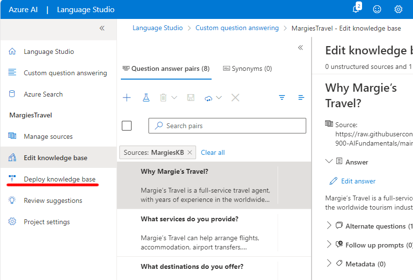

---
lab:
  title: Verwenden von Fragen und Antworten mit Language Studio
---

# Verwenden des „Fragen und Antworten“-Modells mit Language Studio

In dieser Übung werden Sie Language Studio verwenden, um eine Wissensdatenbank mit Fragen und Antworten zu erstellen und zu trainieren, die von einem Kundendienst-Bot verwendet werden soll. Der Inhalt für die Wissensdatenbank wird von einer bestehenden FAQ-Seite der Website von Margie’s Travel, einem fiktiven Reisebüro, stammen. Anschließend verwenden Sie Language Studio, um zu sehen, wie es funktioniert, wenn Kund*innen den Kundendienst-Bot verwenden.

Bei der Implementierung eines Bots besteht der erste Schritt darin, eine Wissensdatenbank mit Frage- und Antwortpaaren zu erstellen. Diese wird zusammen mit eingebauten Features zur Verarbeitung natürlicher Sprache verwendet, damit der Bot Fragen interpretieren und die für die Benutzer*innen am besten geeignete Antwort finden kann.

Azure KI Language umfasst das Feature *Fragen und Antworten*, das Sie zur Erstellung einer Wissensdatenbank verwenden werden. Wissensdatenbanken können entweder durch die manuelle Eingabe von Frage- und Antwortpaaren oder aus einem vorhandenen Dokument oder einer Webseite erstellt werden. Margie’s Travel möchte das vorhandene FAQ-Dokument verwenden.

Mit dem „Fragen und Antworten“-Feature des Sprachdiensts können Sie schnell eine Wissensdatenbank erstellen, indem Sie Frage-Antwort-Paare eingeben oder sie aus einem vorhandenen Dokument oder einer Webseite übertragen. Er kann dann einige integrierte Funktionen zur Verarbeitung natürlicher Sprache nutzen, um Fragen zu interpretieren und passende Antworten zu finden.

## Erstellen einer *Language*-Ressource

Um das Feature „Fragen und Antworten“ zu verwenden, benötigen Sie eine **Language**-Ressource.

1. Öffnen Sie in einem anderen Browsertab das Azure-Portal unter [https://portal.azure.com](https://portal.azure.com?azure-portal=true), und melden Sie sich mit dem Microsoft-Konto an, das Ihrem Azure-Abonnement zugeordnet ist.

1. Klicken Sie auf die Schaltfläche **&#65291;Ressource erstellen** und suchen Sie nach *Sprachdienst*. Wählen Sie **Erstellen** eines **Sprachdienst**-Plans. Sie werden zu einer Seite umgeleitet, um **Weitere Features auszuwählen**. Verwenden Sie folgende Einstellungen:
    - **Auswählen zusätzlicher Features**:
        - **Standardfeatures**: *Behalten Sie die Standardfeatures bei*.
        - **Benutzerdefinierte Features**: *Wählen Sie benutzerdefinierte Beantwortung von Fragen aus*.
     - Wählen Sie **Weiter beim Erstellen Ihrer Ressource**
    

1. Geben Sie auf der Seite **Sprache erstellen** die folgenden Einstellungen an:
    - **Projektdetails**
        - **Abonnement**: *Ihr Azure-Abonnement*.
        - **Ressourcengruppe**: *Wählen Sie eine vorhandene Ressourcengruppe aus, oder erstellen Sie eine neue.*
    - **Instanzendetails**
        - **Region:** *Wählen Sie eine Region aus.*      
        - **Name**: *Ein eindeutiger Name für Ihre Sprachressource*.
        - **Tarif**: S (1.000 Aufrufe pro Minute)
    - **Benutzerdefinierte Fragen und Antworten**
        - **Azure-Suchregion**: *Beliebiger verfügbarer Standort*.
        - **Azure Search-Tarif**: Free F (3 Indizes) – (*Wenn diese Stufe nicht verfügbar ist, wählen Sie „Basic“.*)
    - **Hinweis zu verantwortungsvoller KI**
        - **Durch Aktivieren dieses Kontrollkästchens bestätige ich, dass ich die Bedingungen im Hinweis zu verantwortungsvoller KI überprüft habe und diese anerkenne.** : *Ausgewählt*.

1. Wählen Sie **Überprüfen und erstellen** und dann **Erstellen** aus. Warten Sie auf die Bereitstellung des Sprachdiensts, der Ihre benutzerdefinierte „Fragen und Antworten“-Wissensdatenbank unterstützt.

    > **Hinweis**: Wenn Sie bereits eine kostenlose **Azure Cognitive Search**-Ressource bereitgestellt haben, können Sie mit Ihrem Kontingent möglicherweise keine weitere derartige Ressource erstellen. In diesem Fall wählen Sie einen anderen Tarif als **Free F** aus.

## Erstellen eines neuen Projekts

1. Öffnen Sie auf einer neuen Browserregisterkarte das Language Studio-Portal unter [https://language.azure.com](https://language.azure.com?azure-portal=true), und melden Sie sich mit dem Microsoft-Konto an, das Ihrem Azure-Abonnement zugeordnet ist.
1. Wenn Sie zur Auswahl einer Sprachressource aufgefordert werden, wählen Sie die folgenden Einstellungen aus:
    - **Azure-Verzeichnis**: *Das Azure-Verzeichnis, das Ihr Abonnement enthält*.
    - **Azure-Abonnement:** *Ihr Azure-Abonnement*
    - **Sprachressource**: *Die Sprachressource, die Sie zuvor erstellt haben*.

    Sollten Sie ***nicht*** zur Auswahl einer Sprachressource aufgefordert, kann dies daran liegen, dass Ihr Abonnement mehrere Sprachressourcen enthält. Gehen Sie in diesem Fall folgendermaßen vor:
    1. Wählen Sie oben auf der Leiste die Schaltfläche **Einstellungen (&#9881;)** aus.      
    1. Gehen Sie auf der Seite **Einstellungen** zur Registerkarte **Ressourcen**.
    1. Wählen Sie die soeben erstellte Sprachressource aus, und klicken Sie auf **Ressource wechseln**.
    1. Wählen Sie oben auf der Seite **Language Studio** aus, um zur Startseite von Language Studio zurückzukehren.

1. Wählen Sie oben im Language Studio-Portal im Menü **Neu erstellen** die Option **Custom question answering** (Benutzerdefiniertes „Fragen und Antworten“-Feature) aus.

    

1. Wählen Sie auf der Seite **Spracheinstellung für Ressource *Ihre Ressource* auswählen** die **Option Ich möchte die Sprache auswählen, wenn ich ein Projekt in dieser Ressource erstelle** aus, und klicken Sie dann auf **Weiter**.
  

1. Geben Sie auf der Seite **Enter basic information** (Grundlegende Informationen eingeben) die folgenden Informationen ein, und klicken Sie auf **Weiter**:
    - **Sprachressource**: *Wählen Sie Ihre Sprachressource aus*.  
    - **Azure Search-Ressource**: *Wählen Sie Ihre Azure Search-Ressource aus*.
    - **Name**: `MargiesTravel`
    - **Beschreibung:** `A simple knowledge base`
    - **Ausgangssprache**: Englisch
    - **Standardantwort, wenn keine Antwort zurückgegeben wird**: `No answer found`
1. Wählen Sie auf der Seite **Überprüfen und fertigstellen** die Option **Projekt erstellen** aus.
1. Sie gelangen zur Seite **Quellen verwalten**. Wählen Sie **&#65291;Quelle hinzufügen** und wählen Sie **URLs** aus.
1. Wählen Sie im Feld **URLs hinzufügen** **+ URL hinzufügen** aus. Geben Sie Folgendes ein, und wählen Sie **Alle hinzufügen** aus:
    - **URL-Name**: `MargiesKB`
    - **URL**: `https://raw.githubusercontent.com/MicrosoftLearning/mslearn-ai-fundamentals/main/data/natural-language/margies_faq.docx`
    - **Klassifizieren der Dateistruktur**: *Automatische Erkennung*.
1. Wählen Sie **Alle hinzufügen** aus.  

 

## Bearbeiten der Wissensdatenbank

Ihre Wissensdatenbank basiert auf den Angaben im FAQ-Dokument und einigen vordefinierten Antworten. Sie können diese durch benutzerdefinierte Frage-Antwort-Paare ergänzen.

1. Erweitern Sie den linken Bereich, und wählen Sie **Wissensbasis bearbeiten** aus. Wählen Sie dann **+** aus, um ein neues Frage-Antwortpaar hinzuzufügen.
1. Geben Sie im Dialogfeld **Neues Frage-Antwortpaar hinzufügen** als **Frage** `Hello` ein, und wählen Sie als **Antwort** `Hi` aus. Wählen Sie dann **Fertig** aus.
1. Erweitern Sie **Alternative Fragen** und wählen Sie **+ Alternative Frage hinzufügen** aus. Geben Sie dann `Hiya` als alternative Formulierung für „Hallo“ ein.
1. Wählen Sie oben im Bereich **Frage-Antwortpaare** **Speichern** aus, um Ihre Wissensdatenbank zu speichern.

## Trainieren und Testen der Wissensdatenbank

Da Sie nun über eine Wissensdatenbank verfügen, können Sie diese testen.

1. Wählen Sie oben im Bereich **Frage-Antwortpaare** **Testen** aus, um Ihre Wissensdatenbank zu testen.
1. Geben Sie im Testbereich unten die Nachricht `Hi` ein. Die Antwort *Hi* sollte zurückgegeben werden.
1. Geben Sie im Testbereich unten die Nachricht `I want to book a flight` ein. Es sollte eine entsprechende Antwort aus den häufig gestellten Fragen zurückgegeben werden.

    > **Hinweis**: Die Antwort enthält eine *kurze Antwort* sowie eine ausführlichere *Antwortpassage* – die Antwortpassage zeigt den vollständigen Text des FAQ-Dokuments für die am ehesten zutreffende Frage, während die Kurzantwort intelligent aus der Passage extrahiert wird. Sie können mithilfe des Kontrollkästchens **Display short answer** (Kurzantwort anzeigen) am oberen Rand des Testbereichs steuern, ob die Kurzantwort in der Antwort angezeigt wird.

1. Probieren Sie eine andere Frage aus, z. B. `How can I cancel a reservation?`
1. Wenn Sie mit dem Testen der Wissensdatenbank fertig sind, wählen Sie **Testen**, um den Testbereich zu schließen.

## Erstellen eines Bots für die Wissensdatenbank

Die Wissensdatenbank bietet einen Back-End-Dienst, den Clientanwendungen nutzen können, um Fragen über eine Art von Benutzeroberfläche zu beantworten. Bei diesen Clientanwendungen handelt es sich in der Regel um Bots. Um die Wissensdatenbank für einen Bot zur Verfügung zu stellen, müssen Sie sie als Dienst veröffentlichen, auf den über HTTP zugegriffen werden kann. Mit dem Azure Bot Service können Sie dann einen Bot erstellen und hosten, der die Wissensdatenbank nutzt, um Benutzerfragen zu beantworten.

1. Wählen Sie im linken Bereich **Wissensdatenbank bereitstellen** aus.
1. Wählen Sie oben auf der Seite **Bereitstellen** aus. In einem Dialogfeld wird gefragt, ob Sie das Projekt bereitstellen möchten. Klicken Sie auf **Bereitstellen**.

 

1. Nachdem der Dienst bereitgestellt wurde, wählen Sie **Einen Bot erstellen** aus. Dadurch wird das Azure-Portal auf einer neuen Browserregisterkarte geöffnet, sodass Sie einen Web-App-Bot in Ihrem Azure-Abonnement erstellen können.
1. Erstellen Sie im Azure-Portal einen **Web-App-Bot**. (Möglicherweise wird eine Warnmeldung angezeigt, um zu überprüfen, ob die Quelle der Vorlage vertrauenswürdig ist. Sie müssen keine Maßnahmen für diese Nachricht ergreifen.) Fahren Sie fort, indem Sie die folgenden Einstellungen aktualisieren:

    - **Projektdetails**
        - **Abonnement:** *Geben Sie Ihr Azure-Abonnement an.*
        - **Ressourcengruppe**: *Dies ist die Ressourcengruppe, die Ihre Sprachressource enthält.*
    - **Instanzendetails**
        - **Ressourcengruppenstandort:** *Der gleiche Standort wie für Ihren Sprachdienst*
    - **Azure Bot**
        - **Bot-Handle:** *Ein eindeutiger Name für Ihren Bot* (*vorab aufgefüllt*)
    - **Tarif auswählen**
        - **Tarif:** Free (F0) (Möglicherweise müssen Sie *Plan ändern* auswählen)
    - **Microsoft-App-ID**
        - **Erstellungstyp**: *Wählen Sie **Neue benutzerseitig zugewiesene verwaltete Identität erstellen***. 

5. Wählen Sie **Weiter** aus, um die Einstellungen weiter zu aktualisieren. 
    - **App Service**
        - **App-Name**: *Genau wie bei **Bot-Handle**, wobei **.azurewebsites.net** automatisch angefügt wird*.
        - **SDK-Sprache**: *Wählen Sie entweder C# oder Node.js aus*.
    - **App Service-Plan**
        - **Erstellungstyp**: *Wählen Sie **Erstellen eines neuen App Service-Plans***.
    - **App-Einstellungen**
        - **Sprachressourcenschlüssel**: *Sie müssen Ihren Sprachressourcenschlüssel kopieren und hier einfügen*:
            - Navigieren Sie in einem anderen Browsertab zum Azure-Portal unter [https://portal.azure.com](https://portal.azure.com?azure-portal=true).
            - Gehen Sie zu Ihrer Sprachdienstressource.
            - Kopieren Sie auf der Seite **Schlüssel und Endpunkt** einen der Schlüssel.
            - Fügen Sie ihn hier ein.
        - **Projektname der Sprache:** MargiesTravel
        - **Hostname des Sprachdienstendpunkts:** *Vorab aufgefüllt mit Ihrem Sprachdienstendpunkt*
    - **Sprachdienstdetails**
        - **Abonnement-ID:** *Vorab aufgefüllt mit Ihrer Abonnement-ID*
        - **Ressourcengruppenname:** *Vorab aufgefüllt mit dem Namen Ihrer Ressourcengruppe*
        - **Kontoname:** *Vorab aufgefüllt mit Ihrem Kontonamen*

1. Klicken Sie auf **Erstellen**. Warten Sie dann, bis Ihr Bot erstellt wurde (das Benachrichtigungssymbol oben rechts in Form einer Glocke wird animiert, während Sie warten). Wählen Sie anschließend in der Benachrichtigung über den Abschluss der Bereitstellung **Zu Ressource wechseln** aus (oder wählen Sie alternativ auf der Startseite **Ressourcengruppen** aus, öffnen Sie die Ressourcengruppe, in der Sie den Bot erstellt haben, und wählen Sie die **Azure-Bot**-Ressource aus).
1. Suchen Sie im linken Bereich Ihres Bots nach den **Einstellungen**, wählen Sie **In Webchat testen** aus, und warten Sie, bis der Bot die Nachricht **Hallo and willkommen** anzeigt (die Initialisierung kann einige Sekunden dauern).
1. Verwenden Sie die Testchatschnittstelle, um sicherzustellen, dass Ihr Bot Fragen aus Ihrer Wissensdatenbank wie erwartet beantwortet. Versuchen Sie beispielsweise, `I need to cancel my hotel` zu übermitteln.

Experimentieren Sie mit dem Bot. Wahrscheinlich werden Sie feststellen, dass er Fragen aus den häufig gestellten Fragen recht genau beantworten kann, aber es wird nur begrenzt in der Lage sein, Fragen zu interpretieren, für die er nicht trainiert wurde. Sie können Language Studio jederzeit zur Bearbeitung der Wissensdatenbank verwenden, um sie zu verbessern und dann erneut zu veröffentlichen.

## Bereinigung

Wenn Sie nicht vorhaben, weitere Übungen zu machen, löschen Sie alle Ressourcen, die Sie nicht mehr benötigen. Dadurch werden unnötige Kosten vermieden.

1. Öffnen Sie das [Azure-Portal]( https://portal.azure.com) und wählen Sie die Ressourcengruppe aus, die die Ressource enthält, die Sie erstellt haben. 
1. Wählen Sie die Ressource, dann **Löschen** und anschließend **Ja** aus, um den Löschvorgang zu bestätigen. Die Ressource wird dann gelöscht.

## Weitere Informationen

- Weitere Informationen zum „Fragen und Antworten“-Dienst finden Sie in [der Dokumentation.](https://docs.microsoft.com/azure/cognitive-services/language-service/question-answering/overview)
- Weitere Informationen zum Microsoft Bot Service finden Sie auf der [Azure Bot Service-Seite](https://azure.microsoft.com/services/bot-service/).
