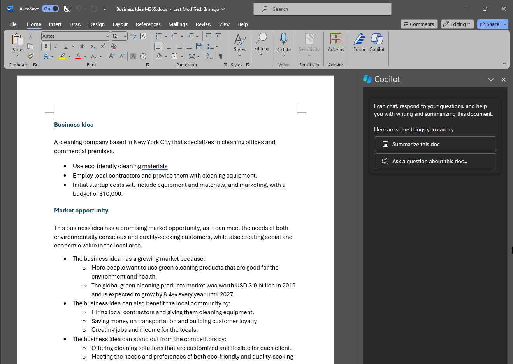
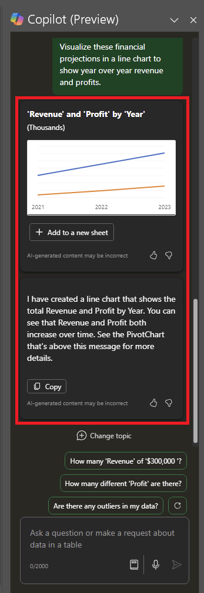

---
lab:
  title: "Erkunden von Copilot für Microsoft\_365"
---
# Erkunden von Copilot für Microsoft 365

In dieser Übung erfahren Sie, wie Microsoft Copilot generative KI verwenden kann, damit Sie beim Erstellen neuer Inhalte noch produktiver sein können. Im Szenario für diese Übung beginnen Sie mit einigen allgemeinen Hinweisen für eine Geschäftsidee und verwenden Copilot für Microsoft 365 in mehreren Apps wie Word, PowerPoint und Excel, um Unterstützung bei der Entwicklung eines Geschäftsplans und einer Präsentation für potenzielle Investoren zu erhalten.

Diese Übung dauert ca. **40** Minuten.

> **Hinweis:** Für diese Übung ist eine Lizenz für **Copilot für Microsoft 365** von Ihrer Organisation erforderlich.

## Verwenden von Copilot, um ein Dokument zu erkunden und für eine Idee zu recherchieren

Wenn Sie mit der Erkundung von generativer KI beginnen möchten, verwenden Sie Copilot für Word, um ein vorhandenes Dokument zu untersuchen und einige Erkenntnisse daraus zu extrahieren.

1. Öffnen Sie in Ihrem Webbrowser das Dokument [Business Idea.docx](https://github.com/MicrosoftLearning/mslearn-ai-fundamentals/raw/main/data/generative-ai/Business%20Idea.docx) unter `https://github.com/MicrosoftLearning/mslearn-ai-fundamentals/raw/main/data/generative-ai/Business%20Idea.docx`. 
1. Wählen Sie **Herunterladen** aus, um die Datei im Ordner **Downloads** Ihres PCs zu speichern.
1. Sie können das eben heruntergeladene Dokument per **Verschieben** oder **Kopieren und einfügen** im **OneDrive**-Ordner ablegen.
1. Öffnen Sie in Ihrem **OneDrive**-Ordner die Datei **Business Idea.docx** in Microsoft Word. (Schließen Sie alle Begrüßungsnachrichten oder Benachrichtigungen über neue Features.) Überprüfen Sie das Dokument, in dem einige allgemeine Ideen für eine Reinigungsfirma in New York City beschrieben werden. Wählen Sie bei entsprechender Aufforderung **Bearbeitung aktivieren** aus.
1. Suchen Sie auf der Word-Symbolleiste das Symbol **Copilot**, und wählen Sie es aus, um den Bereich „Copilot“ zu öffnen, wie hier gezeigt (Ihr visuelles Design kann davon abweichen):

    

1. Geben Sie im Bereich „Copilot“ den folgenden Prompt im Textbereich unten ein:

    ```
    What is this document about?
    ```

1. Überprüfen Sie die Antwort von Copilot, die die wichtigsten Punkte im Dokument zusammenfassen sollte, wie hier gezeigt:

    

    > Die spezifische Antwort, die Sie erhalten, kann aufgrund der Art der generativen KI variieren.

1. Kehren Sie zum Copilot-Bereich zurück, um Copilot die folgende Frage zu stellen:

    ```
    How do I setup a new business in New York?
    ```

1. Sehen Sie sich die Antwort an, und stellen Sie bei Bedarf weitere Fragen. Wenn Sie mit der Antwort zufrieden sind, verwenden Sie das Symbol **Kopieren** (&#128461;) unterhalb der Antwort, um sie in die Zwischenablage zu kopieren. Fügen Sie sie in das Word-Dokument ein, markieren Sie den gesamten Text, und wählen Sie dann das Copilot-Symbol aus, um den Text als Tabelle zu visualisieren.

    

1. Überprüfen Sie die Tabelle, und bitten Sie Copilot, weitere Informationen hinzuzufügen, z. B. Verweise zur weiteren Details.  Ihre Antwort sollte ungefähr wie folgt aussehen (möglicherweise müssen Sie die Schaltfläche **Erneut generieren** verwenden):

    

    > **Wichtig:** Die KI-generierte Antwort basiert auf öffentlichen Informationen aus dem Web. Sie kann Ihnen zwar helfen, die für eine Unternehmensgründung erforderlichen Schritte zu verstehen, es ist aber nicht garantiert, dass sie zu 100 % korrekt ist, und sie ersetzt nicht die Notwendigkeit einer professionellen Beratung!

1. Wenn Sie mit der von Copilot generierten Tabelle zufrieden sind, wählen Sie die Option **Beibehalten** aus.

## Verwenden von Copilot zum Erstellen von Inhalten für einen Geschäftsplan

Sie haben eine erste Recherche durchgeführt. Nun hilft Copilot Ihnen beim Entwickeln eines Geschäftsplans für Ihre Reinigungsfirma.

1. Das Dokument **Business Idea.docx** ist noch geöffnet. Geben Sie im Bereich „Copilot“ den folgenden Prompt ein:

    ```
    Can you suggest a name for my cleaning business?
    ```

1. Überprüfen Sie die Vorschläge, und wählen Sie einen Namen für Ihre Reinigungsfirma aus (oder geben Sie weitere Prompts ein, um einen Namen zu finden, der Ihnen gefällt).
1. Wählen Sie im Word-Dokument das Copilot-Symbol am Rand aus, um neue Inhalte zu entwerfen. Geben Sie den folgenden Prompt ein, und ersetzen Sie **Contoso Cleaning** durch den Firmennamen Ihrer Wahl:

    ```
    Write a business plan for "Contoso Cleaning" based on the information in this document. Include an executive summary, market overview, and financial projections.
    ```

    

1. Überprüfen Sie die von Copilot entworfene Antwort, und behalten Sie sie bei, passen Sie den Tonfall oder die Länge an, oder fordern Sie Copilot mit einem Prompt auf, eine neue Antwort zu verfassen. Wenden Sie geeignete Überschriften und Formatierungen auf Ihr Dokument an, um es professionell zu gestalten. Ihre Antwort sollte in etwa folgendermaßen aussehen:

    

1. Wenn die Finanzprognosen im Geschäftsplan nicht als Tabelle formatiert sind, markieren Sie sie, und verwenden Sie Copilot, um die Prognosen als Tabelle zu visualisieren.
1. Wählen Sie die Tabelle der Finanzprognosen aus, und kopieren Sie sie in die Zwischenablage.
1. Speichern Sie das Word-Dokument.

## Visualisieren von Finanzprognosen in Copilot für Excel

Sie besitzen nun einen Geschäftsplan und können jetzt Copilot in Excel bitten, einige dieser Daten zu Finanzprognosen für Sie zu visualisieren, damit Sie sie in E-Mails oder Präsentationen für Investoren einfügen können.

1. Öffnen Sie **Excel** auf Ihrem PC, auf dem Microsoft 365 Apps installiert ist, und erstellen Sie eine neue leere Arbeitsmappe. Speichern Sie die Arbeitsmappe umgehend unter **Financial Projetions.xlsx** auf OneDrive, andernfalls funktioniert Copilot nicht.
1. Fügen Sie die Tabelle der Umsatzprognosen aus **Business Idea.docx** in die Excel-Tabellenkalkulation ein, und **formatieren Sie sie als Tabelle**. Gehen Sie hierzu folgendermaßen vor:
    1. Wählen Sie eine **Zelle** innerhalb der Daten aus.
    1. Wählen Sie **Start** und unter „Formatvorlagen“ die Option **Als Tabelle formatieren** aus. 
    1. Wählen Sie ein Format für die Tabelle aus.
    1. Bestätigen Sie im Dialogfeld **Tabelle erstellen** den Zellbereich, oder legen Sie ihn fest.
    1. Markieren Sie, ob die Tabelle Überschriften enthält, und wählen Sie **OK** aus.
1. Wenn Sie die Umsatzprognosen als Tabelle formatiert haben, öffnen Sie den Bereich „Copilot“ über das Excel-Menüband, und geben Sie den folgenden Prompt ein:

    ```
    Suggest ways to visualize these financial projections.
    ```
    
1. Copilot sollte 1 oder 2 Möglichkeiten zum Visualisieren Ihrer Daten vorschlagen und anbieten, ein PivotChart zu einem neuen Blatt hinzuzufügen.

    

1. Möglicherweise möchten Sie jedoch weitere Daten im Chart anzeigen, um Änderungen im Vergleich zum Vorjahr anzuzeigen. Geben Sie daher den folgenden Prompt ein, um weitere Daten hinzuzufügen:

    ```
    Visualize these financial projections in a line chart to show year-over-year revenue and profits.
    ```

    

1. Fügen Sie das PivotChart zu einem neuen Blatt hinzu, und öffnen Sie es. Wählen Sie das Chart und dann **Entwurf** aus, um Formatvorlagen anzuwenden, den Diagrammtyp zu ändern und andere Aktionen auszuführen. Am Ende etwa Folgendes angezeigt werden:

    

1. Speichern Sie die Datei auf OneDrive, und schließen Sie Excel.

Sie haben gerade Daten verwendet, die von Copilot in Word erstellt wurden, um sie in Excel zu visualisieren. In der nächsten Übung werden Sie Copilot in Outlook verwenden, um E-Mails zu der von Ihnen erledigten Arbeit zu verfassen und zu senden.

## Verwenden von Copilot zum Verfassen einer E-Mail

Sie haben einige Begleitmaterialien erstellt, die Ihnen bei den ersten Schritten mit Ihrem Unternehmen helfen sollen. Jetzt ist es an der Zeit, einen Investor zu finden, um eine Startfinanzierung zu erhalten.

1. Öffnen Sie **Outlook** auf Ihrem PC, auf dem Microsoft 365 Apps installiert ist. Wenn Sie Outlook nicht mit Ihrem Microsoft 365-Konto eingerichtet haben, lesen Sie die Informationen unter [Einrichten und Verwenden von Outlook – Microsoft-Support](https://support.microsoft.com/office/set-up-and-use-outlook-4636f361-d5e3-4a87-9cd4-382858de55fa).
1. Aktivieren Sie die **neue Outlook-Oberfläche**. Um die neuesten Copilot-Features in Outlook zu erhalten, sollten Sie die Oberfläche „Das neue Outlook“ verwenden. Informationen dazu, welche Version Sie verwenden, finden Sie unter [Microsoft-Support im Abschnitt „Welche Outlook-Version habe ich?“](https://support.microsoft.com/office/what-version-of-outlook-do-i-have-b3a9568c-edb5-42b9-9825-d48d82b2257c).
1. Erstellen Sie eine neue E-Mail, und geben Sie in das Feld **An** Ihre eigene E-Mail-Adresse ein.
1. Sie können mit der Erstellung Ihrer E-Mails über den Bereich „Copilot“ oder direkt im Textkörper der E-Mail beginnen:

    
    
1. Geben Sie den folgenden Prompt ein, und ändern Sie den Tonfall in „Formal“ und die Länge in „Mittel“:

    ```
    Request a meeting with an investment bank to discuss funding for a commercial cleaning business.
    ```

    

1. Wählen Sie **Entwurf generieren** aus, und überprüfen Sie die generierte Ausgabe. Passen Sie den Tonfall an, oder teilen Sie Copilot mit, was Sie an der E-Mail ändern möchten.

    

1. Sie können die E-Mail an sich selbst senden, wenn Sie möchten.

## Verwenden von Copilot zum Erstellen von Inhalten für eine Präsentation

Mit der Hilfe von Copilot haben Sie einen Entwurf eines Geschäftsplans für die Idee einer Reinigungsfirma erstellt, einige Finanzprognosen vorbereitet und eine E-Mail gesendet, um eine Besprechung mit einem potenziellen Investor zu vereinbaren. Jetzt benötigen Sie eine effektive Präsentation, um die Vorteile Ihres Unternehmens zu kommunizieren.

1. Öffnen Sie **PowerPoint**, und eröffnen Sie eine neue **leere Präsentation**. Wenn der Bereich **Designer** automatisch geöffnet wird, schließen Sie ihn.

    

1. Speichern Sie die Präsentation unter **Cleaning Company.pptx** in Ihrem OneDrive-Ordner.
1. Wählen Sie auf der Registerkarte **Start** des Menübands die Schaltfläche **Copilot** und dann **Präsentation erstellen zu...** aus. Schließen Sie dann den Prompt im Bereich „Copilot“ wie folgt ab:

    ```
    Create a presentation about a corporate cleaning service in New York City.
    ```

1. Copilot generiert Folien in der Präsentation.  Der Vorgang kann mehrere Minuten dauern, und die Ausgabe sollte ungefähr wie folgt aussehen:

    

1. Wählen Sie die vorletzte Folie in der Präsentation aus. Fordern Sie dann im Bereich „Copilot“ mithilfe des folgenden Prompts die Erstellung einer neuen Folie an:

    ```
    Add a slide that describes the benefits of an eco-friendly approach to cleaning. 
    ```

    

1. Speichern Sie die Präsentation.

## Herausforderung

Sie haben nun gesehen, wie Sie Copilot für Microsoft 365 in verschiedenen Apps verwenden können, um Ideen zu recherchieren und Inhalte zu generieren. Möchten Sie noch mehr entdecken? Nutzen Sie Copilot, um eine Veranstaltung zur Förderung der Lesekompetenz von Kindern in einer örtlichen Bibliothek zu planen. Sie können beispielsweise Folgendes ausprobieren:

- Tipps recherchieren, wie Kinder schon früh zum Lesen angeregt werden können
- Einen Flyer oder ein Poster für die Veranstaltung erstellen
- Eine E-Mail für eine Kampagne verfassen, um lokale Kinderautoren einzuladen, auf der Veranstaltung zu sprechen
- Eine Präsentation zur Eröffnung der Veranstaltung erstellen

Sie können so erfinderisch sein, wie Sie möchten. Entdecken Sie, wie Copilot Ihnen bei der Suche nach Informationen, der Erstellung und Optimierung von Texten, bei der Erstellung von Bildern sowie bei der Beantwortung von Fragen helfen kann.

## Zusammenfassung

In dieser Übung haben Sie [Copilot für Microsoft 365](https://www.microsoft.com/microsoft-365/enterprise/copilot-for-microsoft-365) verwendet, um Informationen zu finden und Inhalte zu generieren. Sie haben hoffentlich gesehen, wie die Verwendung von generativer KI in einem Copilot die Produktivität und Kreativität steigern kann. Mit Microsoft 365 können Sie die Leistungsfähigkeit von generativer KI auf Ihre Geschäftsdaten und -prozesse übertragen und gleichzeitig in Ihre vorhandene IT-Infrastruktur integrieren, um eine verwaltbare, sichere Lösung zu gewährleisten.
