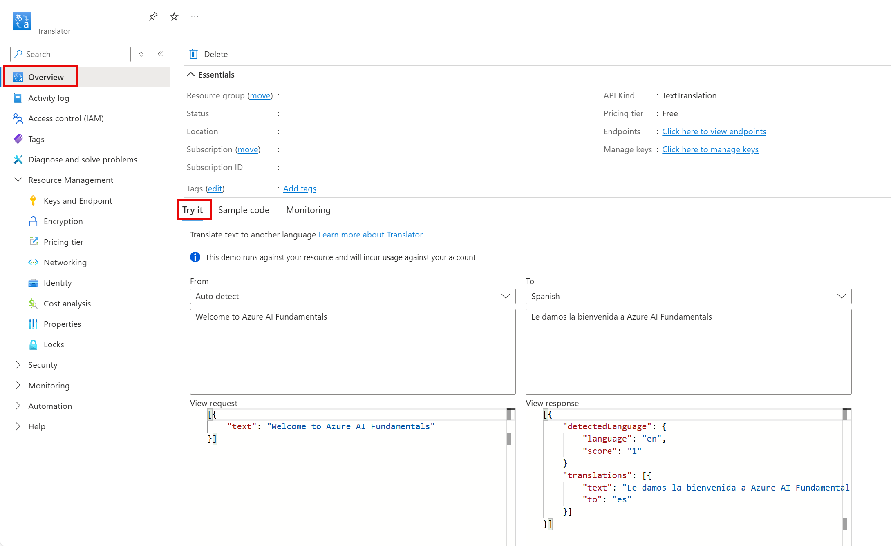

---
lab:
  title: Erkunden von Azure KI Übersetzer
---

# Erkunden von Azure KI Übersetzer

> **Hinweis**: Um dieses Lab abzuschließen, benötigen Sie ein [Azure-Abonnement](https://azure.microsoft.com/free?azure-portal=true), in dem Sie über Administratorzugriff verfügen.

Künstliche Intelligenz (KI) kann die Übersetzung zwischen Sprachen vereinfachen und dazu beitragen, Kommunikationsbarrieren zwischen Ländern und Kulturen zu beseitigen.

Um die Fähigkeiten des Azure KI Übersetzer-Dienstes zu testen, sehen wir ihn uns im Azure-Portal in Aktion an. Die gleichen Prinzipien und Funktionen gelten auch für reale Lösungen, wie Websites oder Smartphone-Apps.

## Eine *Übersetzer*-Ressource erstellen

Sie können den Übersetzerdienst nutzen, indem Sie entweder eine Ressource für den **Übersetzer** oder eine Ressource für **Azure KI Services** erstellen.

Für diese Übung erstellen Sie eine **Translator**-Ressource in Ihrem Azure-Abonnement.

1. Öffnen Sie auf einer anderen Browserregisterkarte das Azure-Portal unter [https://portal.azure.com](https://portal.azure.com?azure-portal=true), und melden Sie sich mit Ihrem Microsoft-Konto an.

1. Klicken Sie auf die Schaltfläche **&#65291;Erstellen einer Ressource** und suchen Sie nach *Übersetzer*. Wählen Sie **Erstellen** aus. Sie werden zu einer Seite weitergeleitet, auf der Sie eine Übersetzer-Ressource erstellen können. Konfigurieren Sie sie mit den folgenden Einstellungen:
    - **Abonnement**: *Ihr Azure-Abonnement*.
    - **Ressourcengruppe**: *Wählen Sie eine Ressourcengruppe aus, oder erstellen Sie eine Ressourcengruppe mit einem eindeutigen Namen*.
    - **Region**: *Wählen Sie eine beliebige verfügbare Region aus.*
    - **Name**: *Geben Sie einen eindeutigen Namen ein*.
    - **Tarif**: Standard S0.

1. Überprüfen und erstellen Sie die Ressource und warten Sie, bis die Bereitstellung abgeschlossen ist. Wechseln Sie dann zur bereitgestellten Ressource.

## Erkunden des Übersetzer-Dienstes 

Wir können die Funktionen des Übersetzerdiensts im Azure-Portal erkunden. 

1. Überprüfen Sie im Azure-Portal in der bereitgestellten Ressource die Seite *Übersicht*.

    

1. Im *Ausprobieren* Abschnitt der Überblicksseite, unter dem *Von: Automatische Erkennung* geben Sie den Text `Welcome to Azure AI Fundamentals` ein. Beachten Sie das JSON, das entsprechend im Abschnitt *Ansichtsanforderung* erscheint. 

1. Zeigen Sie im Abschnitt *Antwort anzeigen* das JSON an. Hinter den Kulissen wurde eine *Anforderung* an den Übersetzer-Dienst gesendet. Die *Antwort* enthält die erkannte Ausgangssprache mit einer Konfidenzbewertung, eine Übersetzung mit dem Alphabet der Ausgabesprache und einen Code für die Ausgabesprache. 

1. Die Demo im Abschnitt *Ausprobieren* zeigt, wie eine einfache Übersetzungsanwendung mit einer Benutzeroberfläche aussehen könnte. Bei der Demo wird, sobald Sie Text eingeben, eine Anfrage an den Übersetzerdienst gestellt. Wie können Sie diese Anforderung stellen? Sehen Sie sich die Registerkarte *Beispielcode* an. Hier sehen Sie Beispiele für Code in verschiedenen Programmiersprachen, der für die Anforderung verwendet werden könnte. 

1. Identifizieren Sie die Zeilen in den Codebeispielen, in denen Sie den **Schlüssel** und **Endpunkt** Ihres Übersetzer-Dienstes einfügen müssen. Mit Ihrem Schlüssel und Endpunkt können Sie eine Anforderung an den Übersetzerdienst senden und eine Antwort erhalten, wie Sie in der Demo gesehen haben. 

1. Navigieren Sie zum linken Menü. Wählen Sie unter *Ressourcenverwaltung* die Option *Schlüssel und Endpunkt* aus. Wenn Sie eine Anwendung erstellen würden, würden Sie hier Ihren Schlüssel und Endpunkt finden. 

## Bereinigung

1. Löschen Sie Ihre Ressource, nachdem Sie sie verwendet haben. 

## Weitere Informationen

Weitere Informationen über die Möglichkeiten dieses Diensts finden Sie auf der Seite für die [Textübersetzung](https://learn.microsoft.com/en-us/azure/ai-services/translator/translator-overview).
