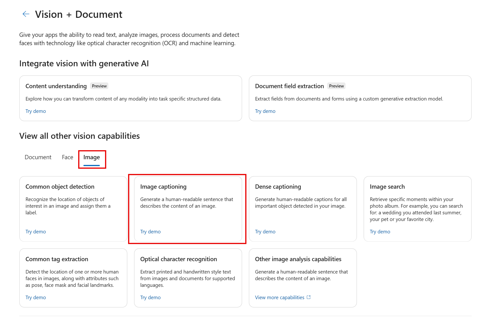

---
lab:
  title: Analysieren von Bildern im Azure AI Foundry-Portal
---

# Analysieren von Bildern im Azure AI Foundry-Portal

**Azure KI Vision** umfasst zahlreiche Funktionen zum Verständnis von Bildinhalten und Kontext sowie zum Extrahieren von Informationen aus Bildern. In dieser Übung verwenden Sie Azure KI Vision im Azure AI Foundry-Portal, die Plattform von Microsoft zum Erstellen intelligenter Anwendungen, um Bilder mithilfe der integrierten Try-it-out-Erfahrungen zu analysieren. 

Angenommen, das fiktive Einzelhandelsunternehmen *Northwind Traders* möchte einen „Smart Store“ implementieren, der von KI überwacht wird, um zu identifizieren, welche Kunden Unterstützung benötigen, und Mitarbeiter*innen zu diesen Kunden zu schicken. Mit Azure KI Vision können Bilder von den Kameras im Geschäft analysiert und aussagekräftige Beschreibungen der Bilder generiert werden.

## Erstellen eines Projekts im Azure KI Foundry-Portal

1. Navigieren Sie auf einer Browserregisterkarte zu [Azure AI Foundry](https://ai.azure.com?azure-portal=true).

1. Melden Sie sich mit Ihrem Konto an. 

1. Wählen Sie auf der Startseite des Azure AI Foundry-Portals die Option **Projekt erstellen** aus. In Azure AI Foundry sind Projekte Container, die Ihnen beim Organisieren Ihrer Arbeit helfen.  

    

1. Im Bereich *Projekt erstellen* sehen Sie einen generierten Projektnamen, den Sie so beibehalten können. Je nachdem, ob Sie in der Vergangenheit einen Hub erstellt haben, wird entweder eine Liste der zu erstellenden *neuen* Azure-Ressourcen oder eine Dropdownliste vorhandener Hubs angezeigt. Wenn Sie die Dropdown-Liste der vorhandenen Hubs sehen, wählen Sie *Neuen Hub erstellen*, erstellen Sie einen eindeutigen Namen für Ihren Hub und wählen Sie *Weiter*.  
 
    

    > **Wichtig**: Sie benötigen eine Azure KI Services-Ressource, die an einem bestimmten Ort bereitgestellt wird, um den Rest des Labs durchzuführen.

1. Wählen Sie im gleichen Fenster *Projekt erstellen* die Option **Anpassen** und wählen Sie einen der folgenden **Standorte**: *USA, Osten, Frankreich, Mitte, Südkorea, Mitte, Europa, Westen oder USA, Westen*, um den Rest des Labs zu vervollständigen. Wählen Sie **Weiter** und anschließend **Erstellen** aus. 

1. Notieren Sie sich die erstellten Ressourcen: 
    - Azure KI Services
    - Azure KI-Hub
    - Azure KI-Projekt
    - Speicherkonto
    - Key vault
    - Ressourcengruppe  
 
1. Nachdem die Ressourcen erstellt wurden, gelangen Sie auf die Seite *Übersicht* Ihres Projekts. Wählen Sie im Menü auf der linken Seite des Bildschirms **KI Services**.
 
      

1. Wählen Sie auf der Seite *KI Services* die Kachel *Vision + Dokument*, um die Azure KI Vision- und Dokument-Funktionen zu testen.

    

## Generieren von Beschriftungen für Bilder

Lassen Sie uns die Bildbeschriftungsfunktion von Azure KI Vision nutzen, um Bilder zu analysieren, die von einer Kamera im Geschäft *Northwind Traders* aufgenommen wurden. Bildbeschriftungen sind über die Features **Caption** und **Dense Captions** von Image Analysis 4.0 verfügbar.

1. Scrollen Sie auf der Seite *Vision + Dokument* nach unten und wählen Sie **Bild** unter *Alle anderen Vision-Funktionen anzeigen*. Wählen Sie dann die Kachel **Bildbeschriftung**.

    

1. Auf der Seite **Bildunterschriften hinzufügen** überprüfen Sie die Ressource, mit der Sie verbunden sind und die unter der Unterüberschrift **Ausprobieren** aufgeführt ist. Sie sollten keine Änderungen vornehmen müssen. (*Hinweis*: Wenn Sie während der Ressourcenerstellung noch keinen gültigen Ressourcenspeicherort angepasst haben, werden Sie möglicherweise aufgefordert, eine neue Azure KI Services-Ressource zu erstellen, die sich in einer gültigen Region befindet. Sie müssen die neue Ressource erstellen, um mit dem Lab fortzufahren.)  

1. Wählen Sie [**https://aka.ms/mslearn-images-for-analysis**](https://aka.ms/mslearn-images-for-analysis) aus, um **image-analysis.zip** herunterzuladen. Öffnen Sie den Ordner auf Ihrem Computer, und suchen Sie die Datei namens **store-camera-1.jpg**, die das folgende Bild enthält:

    

1. Laden Sie das Bild **store-camera-1.jpg** hoch, indem Sie es auf das Feld **Drag and drop files here** ziehen oder indem Sie in ihrem Dateisystem zu dieser Datei navigieren.

1. Beobachten Sie den generierten Beschriftungstext, der im Bereich **Detected attributes** rechts neben dem Bild sichtbar ist.

    Die Funktion **Caption** liefert einen einzelnen, von Menschen lesbaren englischen Satz, der den Inhalt des Bildes beschreibt.

1. Verwenden Sie als Nächstes dasselbe Bild, um die Funktion **Dense captioning** auszuführen. Kehren Sie zur Seite **Vision + Dokument** zurück, indem Sie den Pfeil *zurück* oben auf der Seite wählen. Auf der Seite *Vision + Dokument* wählen Sie die Registerkarte **Bild** und dann die Kachel **Dichte Beschriftung**.

    Die Funktion **Dense Captions** unterscheidet sich von der Funktion **Caption** darin, dass sie mehrere lesbare Beschriftungen für ein Bild bereitstellt, von denen eine den Inhalt des Bildes beschreibt und die anderen jeweils die wichtigsten im Bild erkannten Objekte abdecken. Zu jedem erkannten Objekt gehört ein Begrenzungsrahmen, der die dem Objekt zugeordneten Pixelkoordinaten innerhalb des Bildes definiert.

1. Zeigen Sie mit der Maus auf eine der Beschriftungen in der Liste der **erkannten** Attribute, und beobachten Sie, was innerhalb des Bilds geschieht.

    

    Bewegen Sie den Mauszeiger über die anderen Beschriftungen in der Liste, und beachten Sie, wie sich der Begrenzungsrahmen im Bild verschiebt, um den Teil des Bildes hervorzuheben, der zum Generieren der Beschriftung verwendet wurde.

## Taggen von Bildern 

Das nächste Feature, das Sie ausprobieren werden, ist die Funktion *Extract Tags* zum Extrahieren von Tags. Das Extrahieren von Tags basiert auf Tausenden erkennbaren Objekten, einschließlich Lebewesen, Landschaften und Aktionen.

1. Kehren Sie zur Seite *Vision + Dokument* von Azure KI Foundry zurück, wählen Sie dann die Registerkarte **Bild** und wählen Sie die Kachel **Gemeinsame Tag-Extraktion**.

2. Lassen Sie unter **Choose the model you want to try out** die Option **Prebuilt product vs. gap model** ausgewählt. Wählen Sie unter **Choose your language** die Sprache **Englisch** oder eine Sprache Ihrer Wahl aus.

3. Öffnen Sie den Ordner, der die Bilder enthält, die Sie heruntergeladen haben, und suchen Sie die Datei **store-image-2.jpg**, die wie folgt aussieht:

    

4. Laden Sie die Datei **store-camera-2.jpg** hoch.

5. Überprüfen Sie die Liste der aus dem Bild extrahierten Tags und die Konfidenzwerte für die einzelnen Tags im Bereich der erkannten Attribute. Hier steht der Konfidenzwert für die Wahrscheinlichkeit, dass der Text für das erkannte Attribut das beschreibt, was tatsächlich auf dem Bild zu sehen ist. Beachten Sie in der Liste der Tags, dass sie nicht nur Objekte, sondern Aktionen wie *shopping*, *selling* und *standing* enthält.

    

## Objekterkennung

In dieser Aufgabe verwenden Sie die Funktion **Object detection** der Bildanalyse. Die Objekterkennung erkennt und extrahiert Begrenzungsrahmen basierend auf Tausenden von erkennbaren Objekten und Lebewesen.

1. Kehren Sie zur Seite *Vision + Dokument* von Azure AI Foundry zurück. Wählen Sie dann die Registerkarte **Bild** und wählen Sie die Kachel **Gemeinsame Objekterkennung**.

1. Lassen Sie unter **Choose the model you want to try out** die Option **Prebuilt product vs. gap model** ausgewählt.

1. Öffnen Sie den Ordner, der die heruntergeladenen Bilder enthält, und suchen Sie die Datei **store-camera-3.jpg**, die wie folgt aussieht:

    

1. Laden Sie die Datei **store-camera-3.jpg** hoch.

1. Beobachten Sie im Feld **Detected attributes** die Liste erkannter Objekte und deren Konfidenzwerte.

1. Zeigen Sie mit dem Mauszeiger auf die Objekte in der Liste **Detected attributes**, um den Begrenzungsrahmen des Objekts im Bild hervorzuheben.

1. Verschieben Sie den Schieberegler **Threshold value**, bis der Wert 70 rechts neben dem Schieberegler angezeigt wird. Beobachten Sie, was mit den Objekten in der Liste geschieht. Der Schieberegler für den Schwellenwert legt fest, dass nur Objekte angezeigt werden sollen, deren Konfidenzwert oder Wahrscheinlichkeit größer als der Schwellenwert ist.

## Bereinigung

Wenn Sie nicht vorhaben, weitere Übungen zu machen, löschen Sie alle Ressourcen, die Sie nicht mehr benötigen. Dadurch werden unnötige Kosten vermieden.

1.  Öffnen Sie das [Azure-Portal]( https://portal.azure.com) und wählen Sie die Ressourcengruppe aus, die die Ressourcen enthält, die Sie erstellt haben. 
1.  Wählen Sie die Ressource, dann **Löschen** und anschließend **Ja** aus, um den Löschvorgang zu bestätigen. Die Ressource wird dann gelöscht.

## Weitere Informationen

Weitere Informationen über die Möglichkeiten dieses Diensts finden Sie auf der Seite [Azure KI Vision](https://learn.microsoft.com/azure/ai-services/computer-vision/overview).
